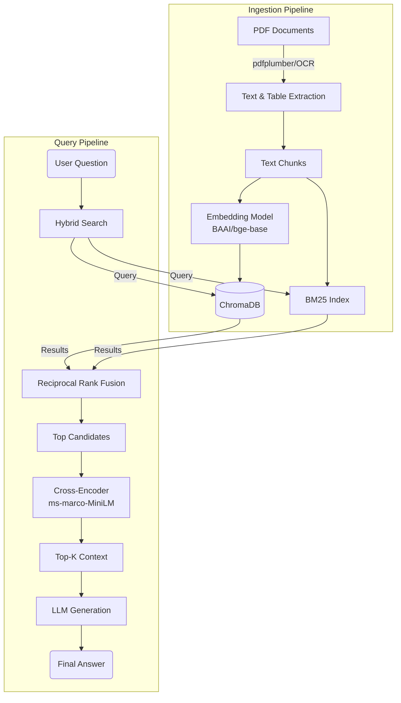

# ⚓ Maritime Regulations RAG Pipeline

[](https://www.python.org/)
[](https://streamlit.io/)
[](https://www.trychroma.com/)
[](https://www.langchain.com/)

> **A specialized Retrieval-Augmented Generation (RAG) system designed to navigate complex maritime documentation, ensuring accurate answers from STCW guides, training manuals, and boat operation handbooks.**

---

## 📖 Overview

This project implements a robust **Hybrid RAG** pipeline capable of digesting technical PDF manuals—handling text, complex tables, and even scanned pages via OCR. It uses a sophisticated retrieval strategy combining dense vector search with sparse keyword search (BM25), followed by Reciprocal Rank Fusion (RRF) and Cross-Encoder re-ranking to deliver high-precision context to the LLM.

### 🚀 Key Features

*   **📄 Advanced Ingestion Pipeline:**
    *   **Hybrid Extraction:** Utilizes `pdfplumber` for text/tables and `pytesseract`/`pdf2image` for OCR fallback on scanned pages.
    *   **Table parsing:** Converts extracted tables into Markdown format for optimal LLM interpretation.
    *   **Smart Chunking:** Uses `RecursiveCharacterTextSplitter` to maintain semantic context.
*   **🔍 State-of-the-Art Retrieval:**
    *   **Hybrid Search:** Combines **Semantic Search** (ChromaDB with `BAAI/bge-base-en-v1.5`) and **Keyword Search** (BM25).
    *   **Reciprocal Rank Fusion (RRF):** Merges results from both search streams fairly.
    *   **Cross-Encoder Re-ranking:** Uses `ms-marco-MiniLM-L-6-v2` to score the top candidates, ensuring the most relevant chunks are presented to the LLM.
*   **🧠 Intelligent Interface:**
    *   **Streamlit Chat UI:** Clean, interactive interface with history.
    *   **Reasoning Display:** Visualizes the LLM's "thought process" (if supported by the model).
    *   **Source Citations:** Transparently shows which document and page the answer was derived from.

---

## 🛠️ Architecture



---

## 📂 Project Structure

```text
D:\Code\RAG\
├── app.py                      # 🚀 Main Streamlit application entry point
├── rag_data/                   # 📁 Input directory for PDF manuals & processed JSONs
├── seamanuals/                 # 🗄️ Persisted ChromaDB and BM25 index
├── scripts/                    # ⚙️ Data processing & Evaluation scripts
│   ├── extract_chunks.py       #    - Step 1: Extracts text/tables -> processed_chunks.json
│   ├── embed_chunks.py         #    - Step 2: Embeds chunks -> ChromaDB + BM25
│   ├── generate_qa_dataset.py  #    - Eval: Generates synthetic Q&A from chunks
│   └── generate_ragas_answers.py #  - Eval: Generates answers for metrics calculation
├── utils/                      # 🧰 Shared utility modules
│   ├── llmclass.py             #    - OpenAI/LLM client wrapper
│   └── search.py               #    - Hybrid Search & Re-ranking logic
└── requirements.txt            # 📦 Python dependencies
```

---

## ⚡ Getting Started

### 1. Prerequisites

Ensure you have **Python 3.10+** installed. You will also need system-level dependencies for image processing:

*   **Poppler:** Required for `pdf2image`.
    *   *Windows:* [Download binary](http://blog.alivate.com.au/poppler-windows/) and add `bin/` to your PATH.
    *   *Linux:* `sudo apt-get install poppler-utils`
    *   *Mac:* `brew install poppler`
*   **Tesseract OCR:** Required for `pytesseract`.
    *   *Windows:* [Download installer](https://github.com/UB-Mannheim/tesseract/wiki) and add to PATH.
    *   *Linux:* `sudo apt-get install tesseract-ocr`
    *   *Mac:* `brew install tesseract`

### 2. Installation

Clone the repository and install dependencies:

```bash
pip install -r requirements.txt
```

### 3. Environment Configuration

Create a `.env` file in the root directory if you are using an API-based LLM (optional if using local models):

```ini
OPENAI_API_KEY=your_key_here
# or for local models (e.g., Ollama)
# OPENAI_BASE_URL=http://localhost:11434/v1
```

---

## 🏃 Usage

### Phase 1: Data Ingestion (Build the Knowledge Base)

1.  **Place your PDFs** into the `rag_data/` directory.
2.  **Extract Content:** Run the extraction script to parse text and tables.
    ```bash
    python scripts/extract_chunks.py
    ```
3.  **Create Index:** Run the embedding script to populate ChromaDB and build the BM25 index.
    ```bash
    python scripts/embed_chunks.py
    ```

### Phase 2: Launch the Assistant

Start the Streamlit interface:

```bash
streamlit run app.py
```

The application will open in your browser at `http://localhost:8501`. You can now ask questions like:
*   *"What are the immediate actions for a man overboard?"*
*   *"Explain the STCW requirements for watchkeeping."*

---

## 🧪 Evaluation (Optional)

This project includes tools to evaluate the RAG pipeline using synthetic data.

1.  **Generate Test Data:** Create a set of "Gold Standard" questions and answers based on your documents.
    ```bash
    python scripts/generate_qa_dataset.py
    ```
2.  **Run Evaluation:** (Requires configuring Ragas)
    ```bash
    python scripts/generate_ragas_answers.py
    ```

---

## 🧩 Tech Stack

*   **Orchestration:** [LangChain](https://www.langchain.com/)
*   **Interface:** [Streamlit](https://streamlit.io/)
*   **Vector Database:** [ChromaDB](https://www.trychroma.com/)
*   **Embeddings:** `BAAI/bge-base-en-v1.5`
*   **Re-ranking:** `cross-encoder/ms-marco-MiniLM-L-6-v2`
*   **PDF Processing:** `pdfplumber`, `pdf2image`, `pytesseract`
*   **LLM Integration:** OpenAI Client (Compatible with GPT-4, Claude, Ollama, etc.)

---

## 🤝 Contributing

Contributions are welcome! Please ensure you update the test notebooks (`Pipeline.ipynb`) when modifying the core search logic.

1.  Fork the Project
2.  Create your Feature Branch (`git checkout -b feature/AmazingFeature`)
3.  Commit your Changes (`git commit -m 'Add some AmazingFeature'`)
4.  Push to the Branch (`git push origin feature/AmazingFeature`)
5.  Open a Pull Request
